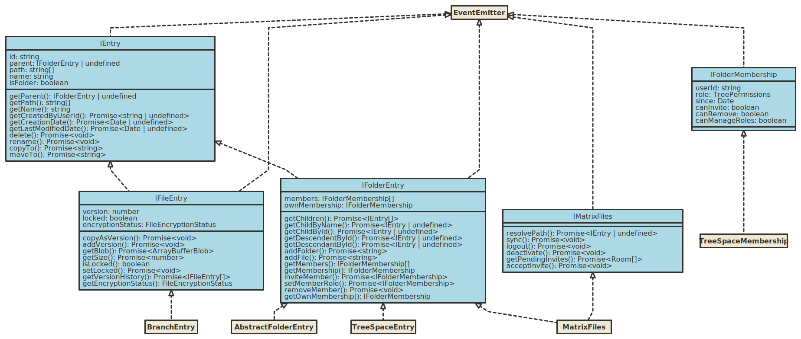

# Matrix Files SDK

Provides a file system like abstraction around MSC3089 tree & branch spaces over [Matrix](https://matrix.org).

Targets LTS versions of Node.js (currently >=12) and browsers.

## Installation

```sh
npm install matrix-files-sdk
```

or for `yarn`:

```sh
yarn add matrix-files-sdk
```

You must install `matrix-js-sdk` in your project as well.

## Usage

For a more complete example of the SDK in use see [vector-im/files-sdk-demo](https://github.com/vector-im/files-sdk-demo).



### Initialisation

The SDK acts as a wrapper around `matrix-js-sdk` so you need to create an instance of `MatrixClient` first.

The main entry point is via the `MatrixFiles` class:

```ts
import { createClient } from 'matrix-js-sdk';
import { MatrixFiles } from 'matrix-files-sdk';

const client = createClient({});

const files = new MatrixFiles(client);

// do initial sync of required state:
await files.sync();
```

### Navigating the hierarchy

You can use the `IFolder.getChildren()` function to discovery entries in the hierarchy:

```ts
import { IEntry } from 'matrix-files-sdk';

...

const entries: IEntry[] = await folder.getChildren();

for (const e: entries) {
  console.log(`${e.getName()} => ${e.isFolder ? 'folder' : 'file' }`);
}

```

Entries are identified by an ID (`IEntry.id` of type `MatrixFilesID`) which are standard Matrix room and event IDs.

The ID can be used on an `IFolder` with `getChildById()` and `getDescendentById()`.

Furthermore the `MatrixFiles.resolvePath()` function can be used to resolve an entry by name from the root of the hierarchy:

```ts
const entry = await files.resolvePath(['My workspace', 'documents', 'file.pdf']);
```

### Common operations on entries

Deleting (redacting) a file:

```ts
await anEntry.delete();
```

Renaming on a folder:

```ts
await aFolder.rename('new name');
```

and a file:

```ts
await aFile.rename('new name.pdf');
```

Moving within the hierarchy:

```ts
const file = await files.resolvePath(['old folder', 'file.pdf']);

const newFolderId = await files.addFolder('new folder');
const newFolder = await files.getDescendentById(newFolderId);

await file.moveTo(newFolder, 'file.pdf');
```

### Observing changes

Files, folders and `MatrixFiles` all implement the `EventEmitter` pattern:

```ts
const file = await files.resolvePath(['old folder', 'file.pdf']);

file.on('modified', () => { console.log('file modified'); });
```
