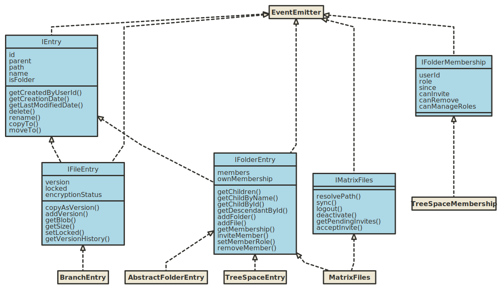

# Matrix Files SDK

Provides a file system like abstraction around MSC3089 tree & branch spaces over [Matrix](https://matrix.org).

Targets LTS versions of Node.js (currently >=12) and browsers.

## Installation

```sh
npm install matrix-files-sdk
```

or for `yarn`:

```sh
yarn add matrix-files-sdk
```

You must install `matrix-js-sdk` in your project as well.

## Usage

For a more complete example of the SDK in use see [vector-im/files-sdk-demo](https://github.com/vector-im/files-sdk-demo).


